# Tarefa_3.1b

Este documento descreve todos os ficheiros criados para as novas entidades **Patrocinadores** e **Especialistas** no projeto Animalec. Para cada ecrã, são apresentados os artefatos produzidos (wireframes, mockups e protótipo funcional) e a justificação das escolhas de design e campos de dados.

---

## 1. Patrocinador

### 1.1. Listar Patrocinadores

**Descrição:**  
Ecrã que apresenta a lista de todos os patrocinadores registados no sistema. Permite visualizar informações sumárias (nome, animal associado, website) e ações rápidas (ver detalhes, editar, apagar). Inclui botão de ação principal para adicionar novos patrocinadores.

**Ficheiros criados:**

- **Wireframe (Desktop):** `wireframes/sponsors-list.html`  
  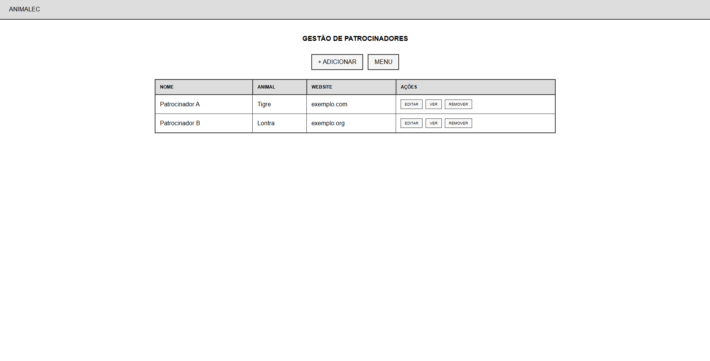

- **Wireframe (Mobile):** `wireframes/mobile/sponsors-list.html`  
  

- **Mockup (Desktop):** `mockups/sponsors-list.html`  
  

- **Mockup (Mobile):** `mockups/mobile/sponsors-list.html`  
  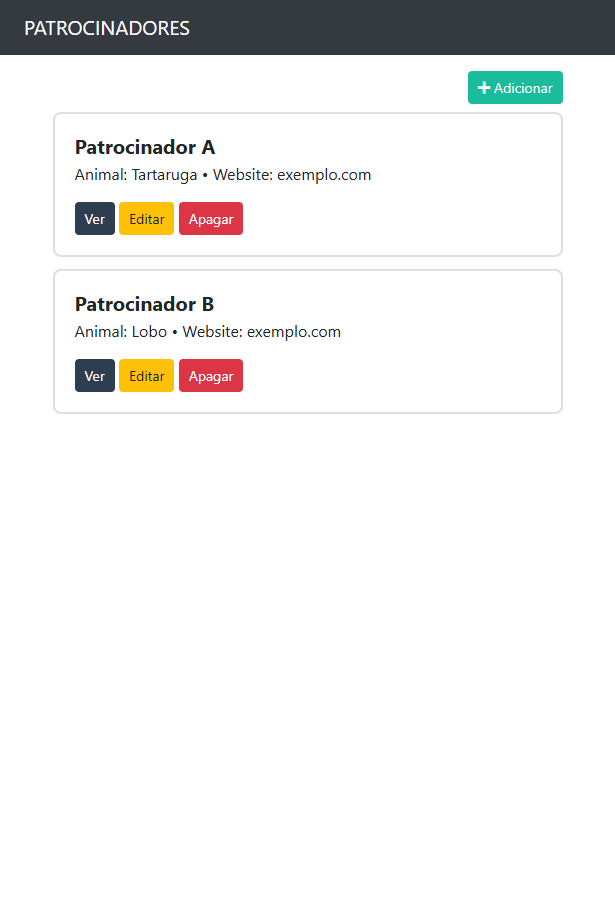

- **Protótipo funcional:** `prototype/index.html` (rota `#sponsors`)

**Características:**
- Layout em tabela (desktop) ou cards (mobile) para facilitar a leitura.
- Ações inline (Ver, Editar, Apagar) para cada registo.
- Botão "ADICIONAR" em posição de destaque para criar novos patrocinadores.

---

### 1.2. Detalhes do Patrocinador

**Descrição:**  
Ecrã de visualização detalhada de um patrocinador específico. Apresenta todas as informações associadas ao patrocinador de forma estruturada e legível, sem campos editáveis.

**Ficheiros criados:**

- **Wireframe (Desktop):** `wireframes/sponsor-detail.html`  
  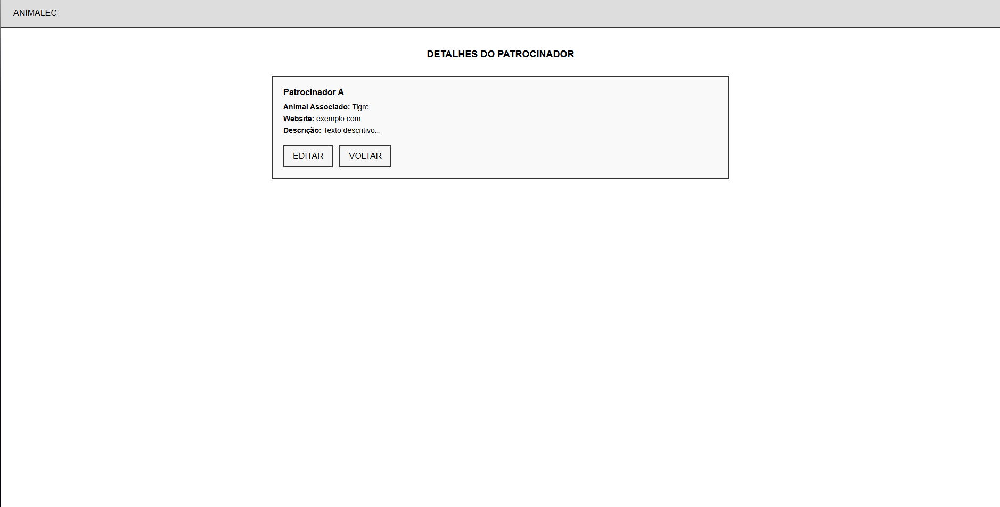

- **Wireframe (Mobile):** `wireframes/mobile/sponsor-detail.html`  
  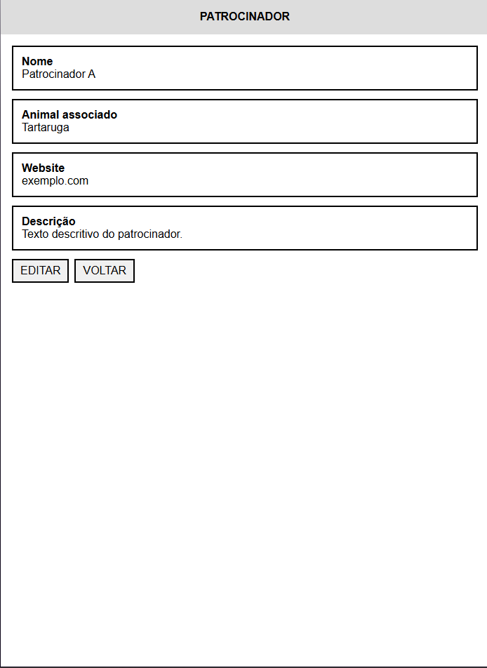

- **Mockup (Desktop):** `mockups/sponsor-detail.html`  
  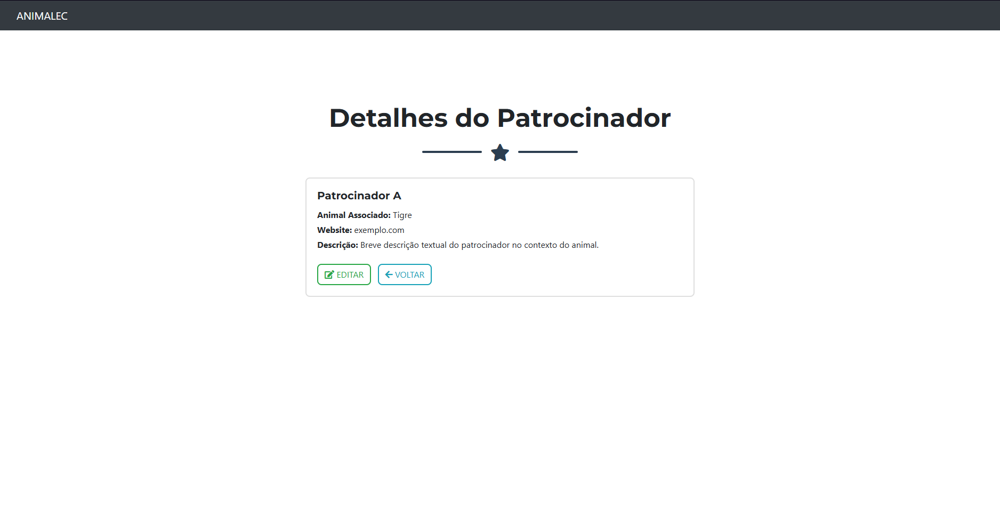

- **Mockup (Mobile):** `mockups/mobile/sponsor-detail.html`  
  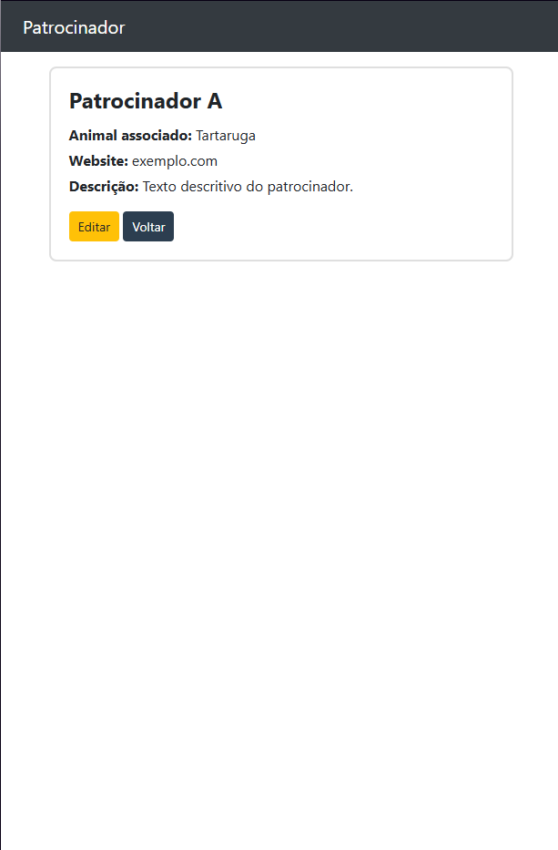

- **Protótipo funcional:** `prototype/index.html` (rota `#sponsors/view/:id`)

**Características:**
- Layout em card com informações distribuídas em blocos (Nome, Animal associado, Website, Descrição).
- Ações disponíveis: Editar e Voltar.
- Fotografia/logotipo **não incluído** para simplificar a gestão de dados e manter consistência com a funcionalidade implementada.

---

### 1.3. Criar/Editar Patrocinador

**Descrição:**  
Formulário para criação ou edição de um patrocinador. Permite inserir ou atualizar as informações essenciais do patrocinador.

**Ficheiros criados:**

- **Wireframe (Desktop):** `wireframes/sponsor-form.html`  
  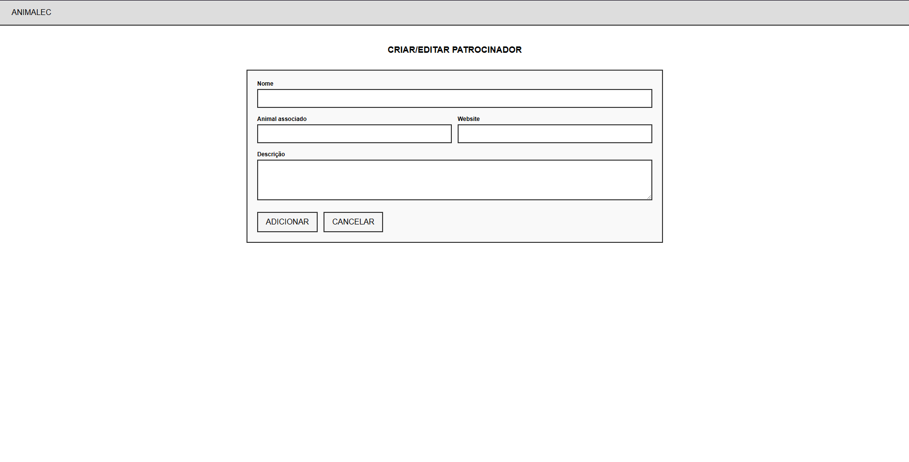

- **Wireframe (Mobile):** `wireframes/mobile/sponsor-form.html`  
  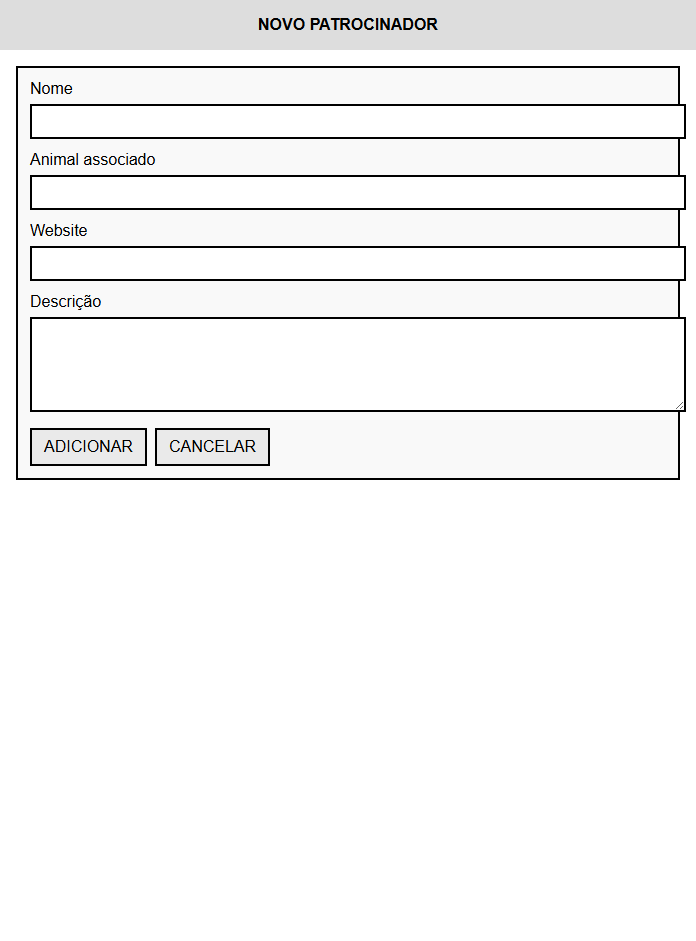

- **Mockup (Desktop):** `mockups/sponsor-form.html`  
  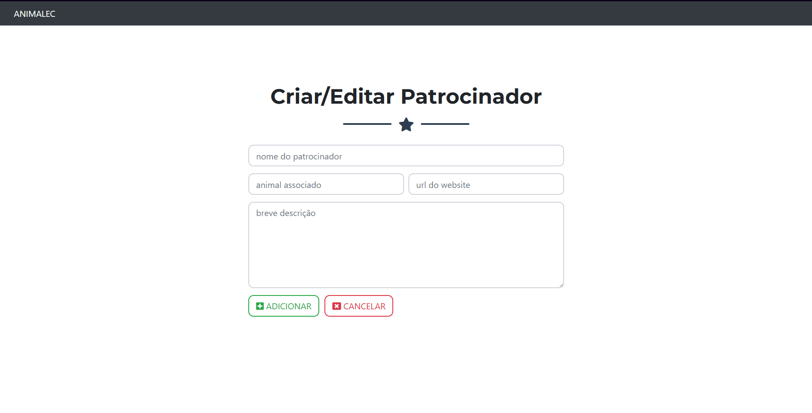

- **Mockup (Mobile):** `mockups/mobile/sponsor-form.html`  
  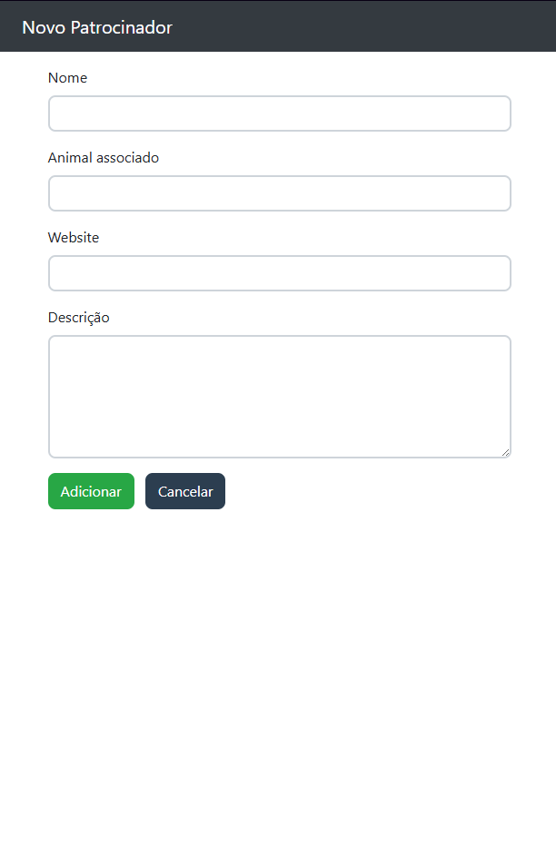

- **Protótipo funcional:** `prototype/index.html` (rotas `#sponsors/create` e `#sponsors/edit/:id`)

**Campos do formulário:**

1. **Nome** (obrigatório)  
   - Identificação principal do patrocinador.
   - Campo de texto simples.

2. **Animal associado** (obrigatório)  
   - Relaciona o patrocinador a um animal específico do projeto Animalec.
   - Campo de texto livre para permitir flexibilidade (pode ser adaptado posteriormente para um select com lista de animais existentes).
   - **Justificação:** O objetivo é criar uma ligação temática entre patrocinadores e o conteúdo educativo sobre animais, incentivando o apoio dirigido a espécies específicas.

3. **Website** (opcional)  
   - URL do website oficial do patrocinador.
   - Permite aos utilizadores conhecerem melhor a entidade patrocinadora.
   - **Justificação:** Facilita a divulgação e reconhecimento do patrocinador, criando valor para ambas as partes (projeto e patrocinador).

4. **Descrição** (opcional)  
   - Campo de texto longo para apresentar informações adicionais sobre o patrocinador, sua missão, projetos ou contribuições.
   - **Justificação:** Oferece contexto adicional e humaniza a relação entre o projeto e os apoiantes, tornando a parceria mais significativa para os utilizadores finais.

**Ações:**
- **ADICIONAR / GUARDAR:** Submete o formulário e persiste os dados.
- **CANCELAR:** Retorna à lista sem guardar alterações.

---

## 2. Especialista

### 2.1. Listar Especialistas

**Descrição:**  
Ecrã que apresenta a lista de todos os especialistas registados. Mostra informações resumidas (nome, especialidade, email) e permite ações rápidas de visualização, edição e remoção. Inclui botão para adicionar novos especialistas.

**Ficheiros criados:**

- **Wireframe (Desktop):** `wireframes/experts-list.html`  
  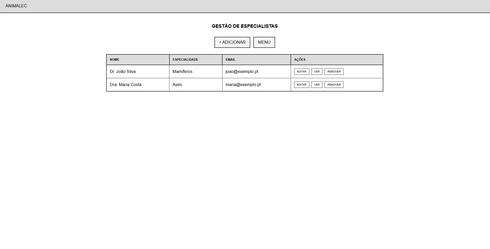

- **Wireframe (Mobile):** `wireframes/mobile/experts-list.html`  
  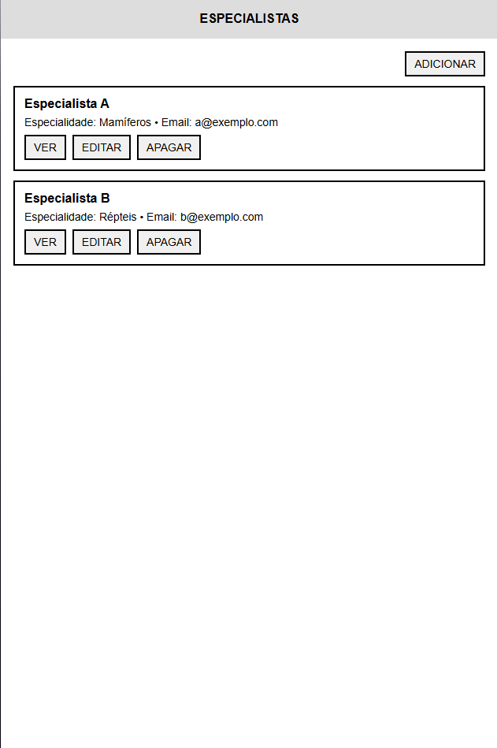

- **Mockup (Desktop):** `mockups/experts-list.html`  
  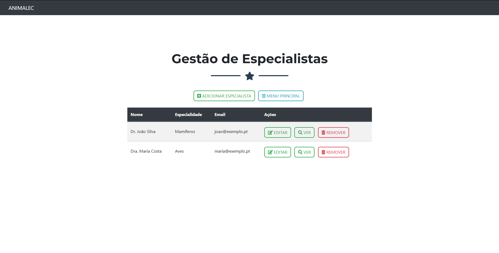

- **Mockup (Mobile):** `mockups/mobile/experts-list.html`  
  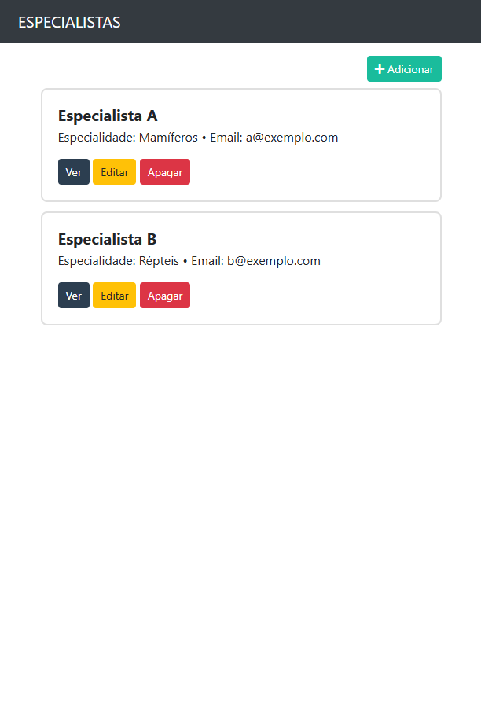

- **Protótipo funcional:** `prototype/index.html` (rota `#experts`)

**Características:**
- Layout em tabela (desktop) ou cards (mobile).
- Ações inline por registo: Ver, Editar, Apagar.
- Botão "ADICIONAR" destacado no topo.

---

### 2.2. Detalhes do Especialista

**Descrição:**  
Ecrã de visualização detalhada de um especialista. Apresenta todas as informações do perfil do especialista de forma clara e organizada.

**Ficheiros criados:**

- **Wireframe (Desktop):** `wireframes/expert-detail.html`  
  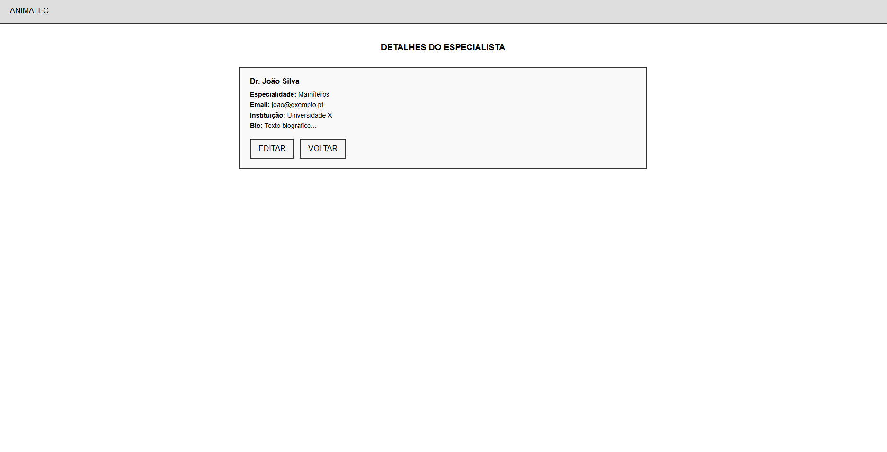

- **Wireframe (Mobile):** `wireframes/mobile/expert-detail.html`  
  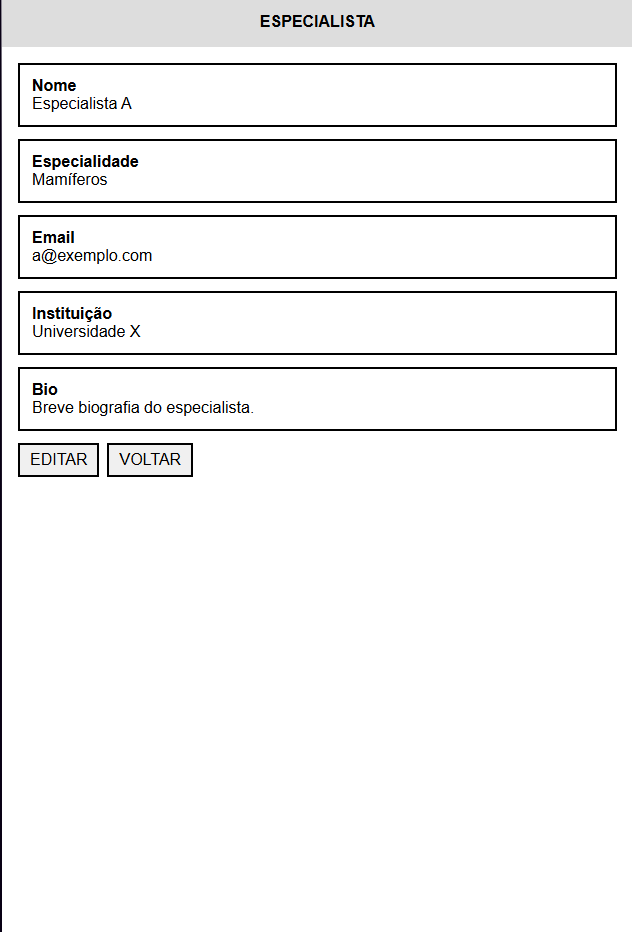

- **Mockup (Desktop):** `mockups/expert-detail.html`  
  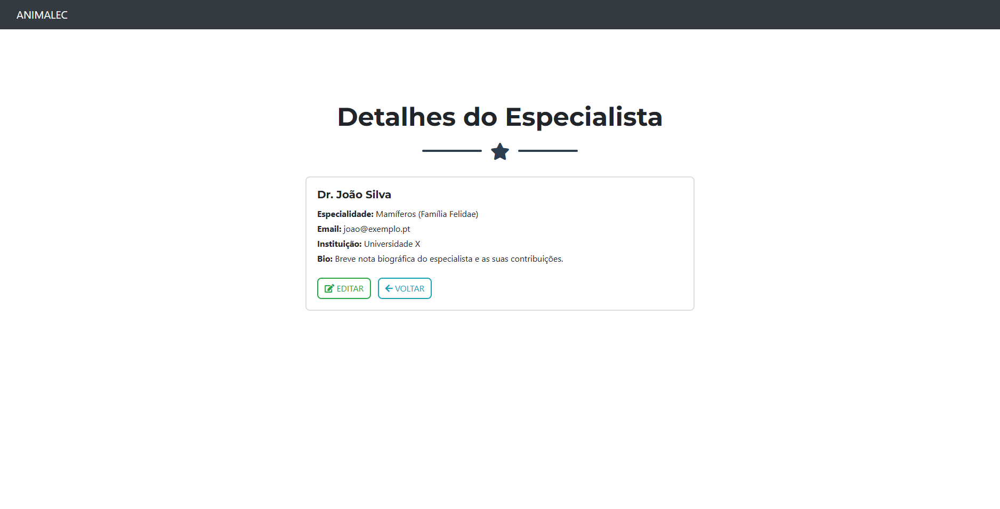

- **Mockup (Mobile):** `mockups/mobile/expert-detail.html`  
  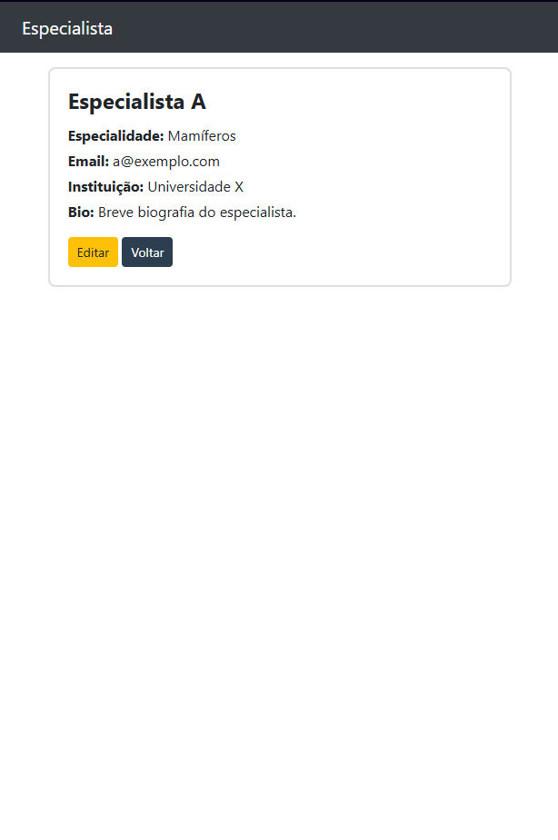

- **Protótipo funcional:** `prototype/index.html` (rota `#experts/view/:id`)

**Características:**
- Layout em card com blocos de informação (Nome, Especialidade, Email, Instituição, Bio).
- Ações: Editar e Voltar.
- Sem fotografia para manter coerência com a implementação atual.

---

### 2.3. Criar/Editar Especialista

**Descrição:**  
Formulário para criação ou edição de um especialista. Permite gerir as informações dos especialistas que colaboram com o projeto.

**Ficheiros criados:**

- **Wireframe (Desktop):** `wireframes/expert-form.html`  
  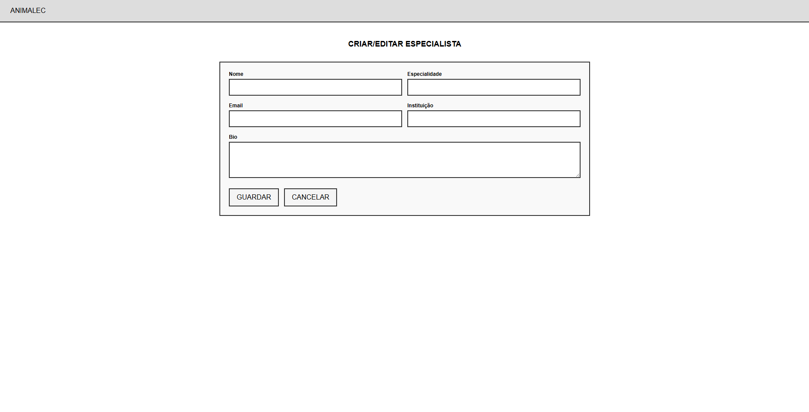

- **Wireframe (Mobile):** `wireframes/mobile/expert-form.html`  
  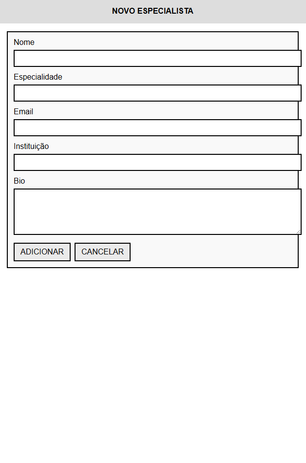

- **Mockup (Desktop):** `mockups/expert-form.html`  
  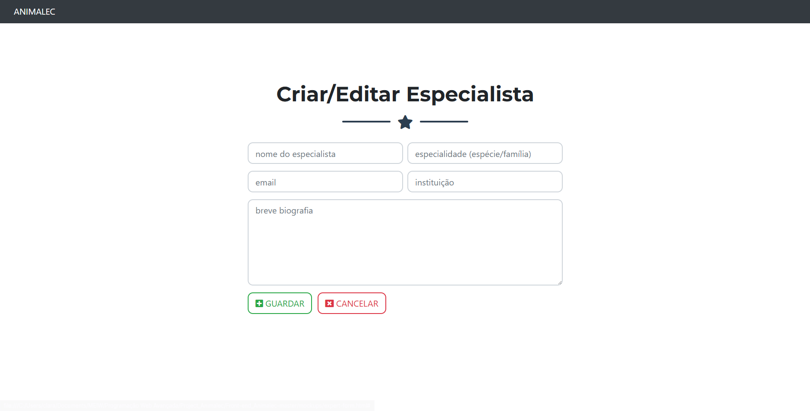

- **Mockup (Mobile):** `mockups/mobile/expert-form.html`  
  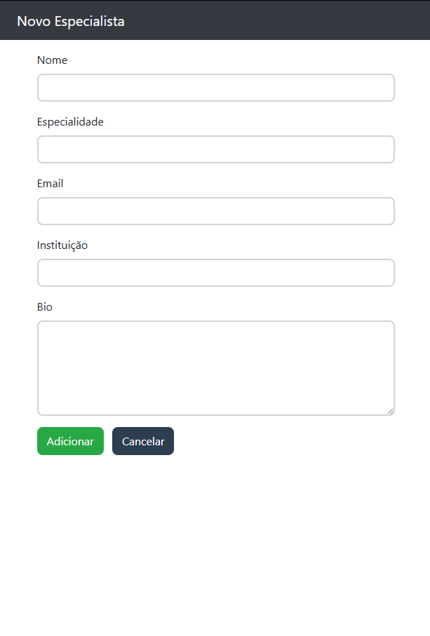

- **Protótipo funcional:** `prototype/index.html` (rotas `#experts/create` e `#experts/edit/:id`)

**Campos do formulário:**

1. **Nome** (obrigatório)  
   - Identificação completa do especialista.
   - Campo de texto simples.

2. **Especialidade** (obrigatório)  
   - Área de conhecimento ou categoria de animais em que o especialista é reconhecido (ex: Mamíferos, Répteis, Aves, Biologia Marinha, Conservação).
   - Campo de texto livre.
   - **Justificação:** Permite aos utilizadores e administradores identificar rapidamente a área de expertise, facilitando contactos direcionados e enriquecendo o conteúdo educativo do projeto com contribuições especializadas.

3. **Email** (obrigatório)  
   - Endereço de email de contacto do especialista.
   - **Justificação:** Canal de comunicação essencial para colaborações, esclarecimento de dúvidas dos utilizadores, e gestão de conteúdos. Garante que o projeto mantém uma linha direta com os especialistas.

4. **Instituição** (opcional)  
   - Nome da universidade, organização, ou entidade à qual o especialista está associado (ex: Universidade de Lisboa, Jardim Zoológico, ONG de Conservação).
   - **Justificação:** Confere credibilidade e contexto profissional ao especialista, aumentando a confiança dos utilizadores nas informações partilhadas. Também promove as instituições parceiras.

5. **Bio** (opcional)  
   - Campo de texto longo para uma breve biografia ou descrição do percurso, interesses e contribuições do especialista.
   - **Justificação:** Humaniza a experiência, permitindo aos utilizadores conhecer melhor os especialistas. Fortalece o vínculo entre a comunidade do projeto e os profissionais que contribuem para a sua qualidade educativa.

**Ações:**
- **ADICIONAR / GUARDAR:** Submete o formulário e persiste os dados.
- **CANCELAR:** Retorna à lista sem guardar alterações.

---

## 3. Página Inicial (Home)

**Descrição:**  
A página inicial foi atualizada para incluir uma secção **REGRAS** (orientações de utilização do projeto) e uma secção **CONTACTOS** (formulário de contacto direto com os criadores).

**Ficheiros criados/atualizados:**

- **Wireframe (Desktop):** `wireframes/index.html`  
  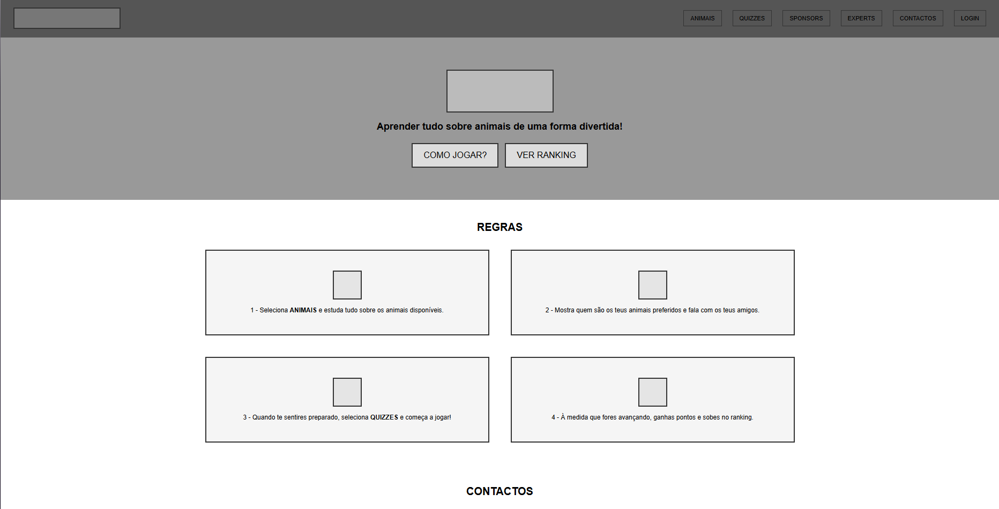
  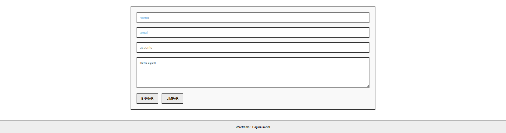

- **Wireframe (Mobile):** `wireframes/mobile/index.html`  
  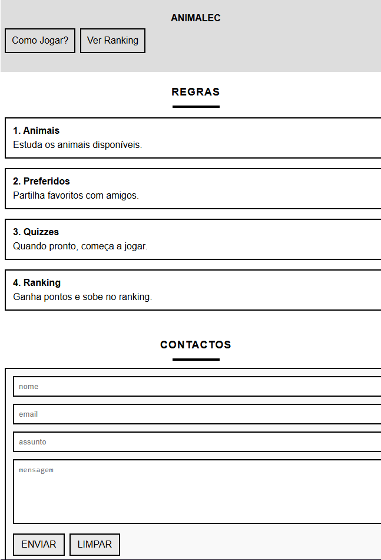

- **Mockup (Desktop):** `mockups/index.html`  
  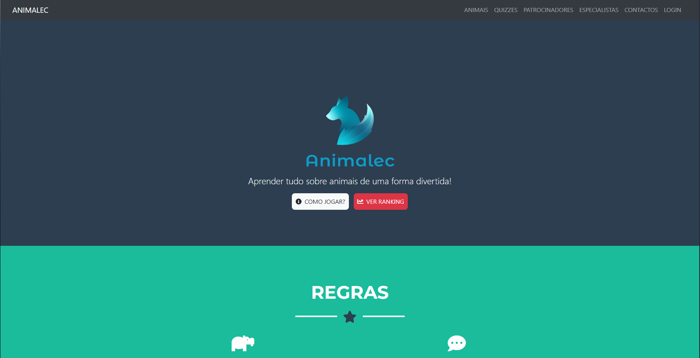

- **Mockup (Mobile):** `mockups/mobile/index.html`  
  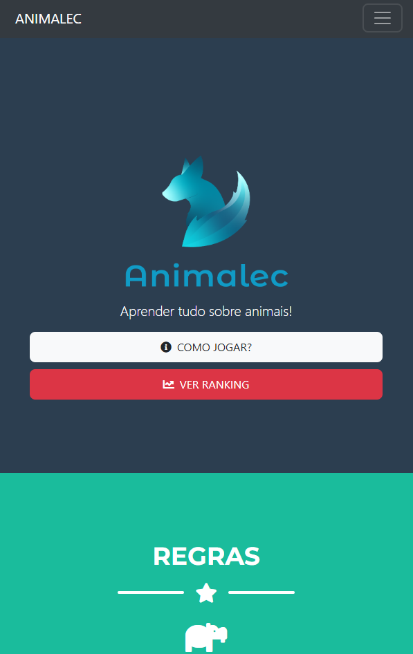

- **Protótipo funcional:** `prototype/index.html` (rota `#home`)

**Secções:**
- **Hero:** Apresentação do projeto e botões de ação principais (Como Jogar?, Ver Ranking).
- **REGRAS:** Quatro orientações organizadas em grid 2x2 (desktop) ou coluna única (mobile) explicando como usar o projeto.
- **CONTACTOS:** Formulário com campos Nome, Email, Assunto, Mensagem e botões Enviar/Limpar.

---

## 4. Protótipo Funcional

**Localização:** `prototype/`

**Ficheiros:**
- `index.html` — Ponto de entrada do protótipo; contém estrutura HTML, navegação e área de conteúdo dinâmico.
- `app.js` — Lógica de aplicação (routing, CRUD operations, rendering).
- `style.css` — Estilos customizados para o protótipo.
- `data.json` — Ficheiro de referência (informativo; dados persistem em `localStorage`).

**Funcionalidades:**
- Navegação por hash routing (`#home`, `#sponsors`, `#experts`, etc.).
- CRUD completo para Patrocinadores e Especialistas.
- Persistência em `localStorage` para simular backend.
- Pode ser executado abrindo `prototype/index.html` diretamente no navegador (sem servidor).

**Rotas disponíveis:**
- `#home` — Página inicial.
- `#sponsors` — Lista de patrocinadores.
- `#sponsors/view/:id` — Detalhes de um patrocinador.
- `#sponsors/create` — Criar novo patrocinador.
- `#sponsors/edit/:id` — Editar patrocinador existente.
- `#experts` — Lista de especialistas.
- `#experts/view/:id` — Detalhes de um especialista.
- `#experts/create` — Criar novo especialista.
- `#experts/edit/:id` — Editar especialista existente.

---

## 5. Estrutura de Pastas

```
wireframes/
  index.html
  sponsors-list.html
  sponsor-detail.html
  sponsor-form.html
  experts-list.html
  expert-detail.html
  expert-form.html
  mobile/
    index.html
    sponsors-list.html
    sponsor-detail.html
    sponsor-form.html
    experts-list.html
    expert-detail.html
    expert-form.html

mockups/
  index.html
  sponsors-list.html
  sponsor-detail.html
  sponsor-form.html
  experts-list.html
  expert-detail.html
  expert-form.html
  mobile/
    index.html
    sponsors-list.html
    sponsor-detail.html
    sponsor-form.html
    experts-list.html
    expert-detail.html
    expert-form.html

prototype/
  index.html
  app.js
  style.css
  data.json
```

---

## 6. Resumo das Decisões de Design

### Campos dos Formulários

**Patrocinadores:**
- **Nome, Animal associado, Website, Descrição** — Campos escolhidos para estabelecer uma ligação temática entre patrocinadores e o conteúdo educativo, promover a visibilidade dos parceiros e fornecer contexto significativo aos utilizadores.
- **Sem logotipo:** Decisão de simplificação inicial; pode ser adicionado posteriormente.

**Especialistas:**
- **Nome, Especialidade, Email, Instituição, Bio** — Campos selecionados para validar a credibilidade dos especialistas, facilitar comunicação, promover instituições parceiras e humanizar a interação com a comunidade.
- **Sem fotografia:** Decisão de simplificação inicial; pode ser adicionado posteriormente.

### Layouts

- **Desktop:** Aproveita espaço horizontal com grids de 2 colunas (REGRAS, formulários em 2 colunas), tabelas (listas) e cards (detalhes).
- **Mobile:** Layout em coluna única com cards empilhados, botões de toque amplos e formulários full-width para otimizar usabilidade em dispositivos móveis.

### Consistência

- Wireframes mantêm estilo B&W e simplicidade.
- Mockups seguem a identidade visual do Animalec (cores #1abc9c e #2c3e50, tipografia Montserrat/Lato, Bootstrap 4).
- Protótipo replica a funcionalidade dos mockups com persistência local e navegação fluida.

---

**Nota final:** Todos os artefatos foram desenvolvidos de forma iterativa, garantindo alinhamento entre wireframes, mockups e protótipo funcional. As decisões de design foram guiadas pelos objetivos do projeto: promover aprendizagem sobre animais, reconhecer patrocinadores e conectar utilizadores com especialistas de forma simples e eficaz.
